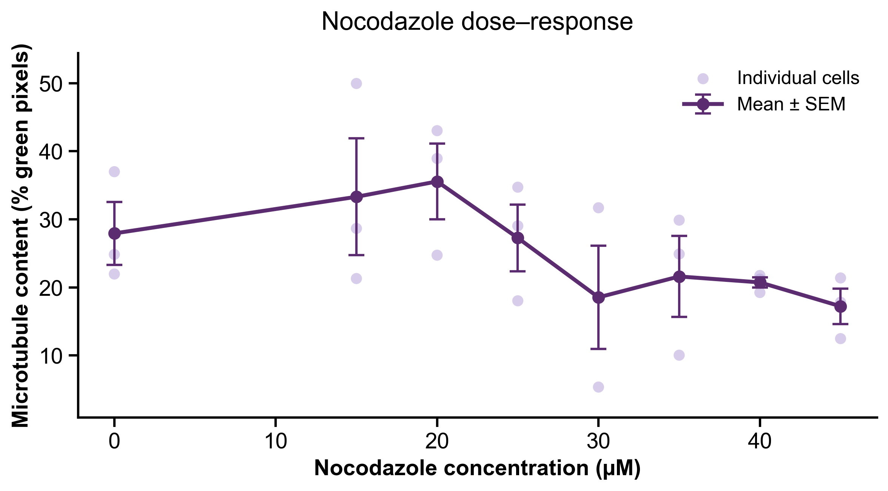
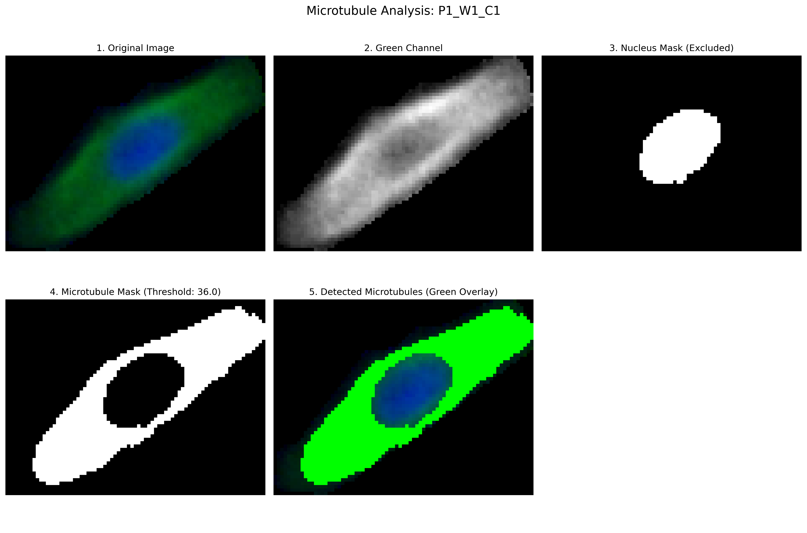
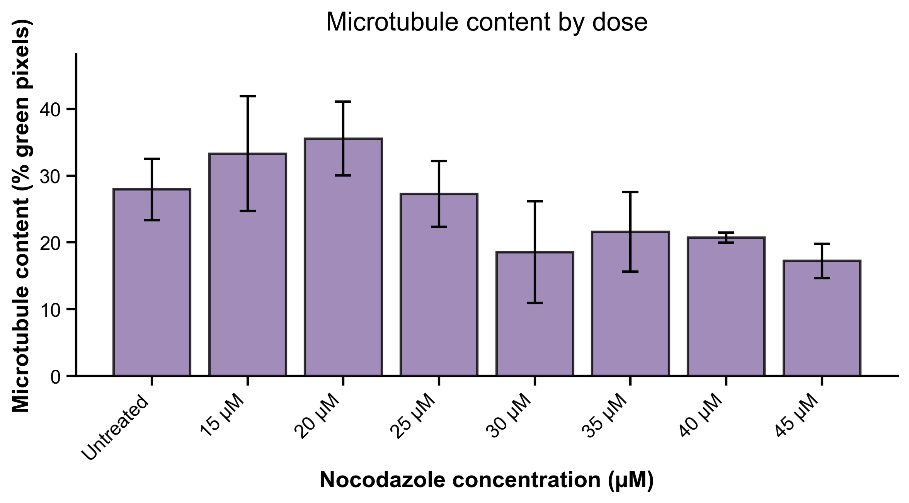

# Microtubule Quantification Tool

An automated image analysis pipeline for quantifying microtubule content in fluorescent microscopy images. This tool measures the percentage of green fluorescent pixels (microtubules) in cropped cell images while excluding blue-stained nuclei, enabling dose-response analysis of microtubule-targeting drugs.



## Overview

This tool was developed to analyze the effects of nocodazole (a microtubule-destabilizing drug) on cellular microtubule networks. It processes immunofluorescent images where:
- **Green channel**: Microtubules (anti-tubulin antibodies)
- **Blue channel**: Nuclei (DAPI or similar nuclear stain)

The pipeline automatically:
1. Extracts the green channel (microtubules)
2. Identifies and excludes the nucleus (blue channel)
3. Applies optimal thresholding to detect microtubules
4. Calculates the percentage of cell area occupied by microtubules
5. Generates dose-response curves with statistical analysis

## Features

- **Automated nucleus exclusion**: Blue-stained nuclei are automatically detected and excluded from quantification
- **Robust thresholding**: Uses Otsu's method for automatic, optimal threshold selection
- **Quality verification**: Generates mask images for visual verification of detection accuracy
- **Batch processing**: Process multiple cells simultaneously with metadata tracking
- **Statistical analysis**: Automatic calculation of means, standard errors, and dose-response curves
- **Comprehensive visualization**: Multiple output formats including overlays, masks, and processing steps

## Installation

### Requirements
- Python 3.7+
- OpenCV
- NumPy
- Pandas
- Matplotlib

### Setup

```bash
# Clone the repository
git clone https://github.com/KalpKan/Microtubule-Quantification.git
cd Microtubule-Quantification

# Install dependencies
pip install -r requirements.txt
```

## Quick Start

### 1. Test on a Single Cell

Before batch processing, test the algorithm on one cell:

```bash
python test_single_cell.py path/to/your_cell_image.png
```

This will display all processing steps and generate verification images. Review the mask to ensure microtubules are detected correctly.

### 2. Prepare Your Data

**Organize your images:**
- Crop each cell along its border
- Save as individual image files (PNG, JPG, or TIFF)
- Place all images in one directory

**Create metadata.csv:**

```csv
image_name,condition,dose,drug,include_in_curve
P1_W1_C1,untreated,0,None,yes
P1_W1_C2,untreated,0,None,yes
P1_W1_C3,untreated,0,None,yes
P3_W4_C1,nocodazole_15uM,15,Nocodazole,yes
P3_W4_C2,nocodazole_15uM,15,Nocodazole,yes
P3_W4_C3,nocodazole_15uM,15,Nocodazole,yes
P1_W2_C1,DMSO_control,0,DMSO,no
P1_W2_C2,DMSO_control,0,DMSO,no
P1_W2_C3,DMSO_control,0,DMSO,no
```

**Columns:**
- `image_name`: Filename without extension (must match your image files exactly)
- `condition`: Descriptive label for the condition
- `dose`: Numeric dose value (use 0 for controls)
- `drug`: Drug name or "None" for untreated
- `include_in_curve`: "yes" to include in dose-response curve, "no" for separate controls

### 3. Run Batch Analysis

**Option A: Using the wrapper script (easiest)**

Edit `run_analysis.py` to set your paths:
```python
INPUT_DIR = "/path/to/your/cell_images"
OUTPUT_DIR = "/path/to/output"
METADATA_FILE = "metadata.csv"
```

Then run:
```bash
python run_analysis.py
```

**Option B: Command line**

```bash
python microtubule_quantification.py \
  --input /path/to/cell_images \
  --output /path/to/results \
  --metadata metadata.csv
```

## Output Files

The analysis generates several files for each cell:

### Per-Cell Outputs
- `[cellname]_mask.png`: Binary mask showing detected microtubules (white = counted)
- `[cellname]_overlay.png`: Original image with detected microtubules highlighted in green
- `[cellname]_analysis.png`: Complete processing pipeline visualization

### Summary Outputs
- `quantification_results.csv`: All measurements with metadata
- `dose_response_curve.png`: Scatter plot with mean ± SEM
- `dose_response_barplot.png`: Bar chart of results by dose

## Example Results

### Processing Pipeline


The pipeline shows:
1. Original image
2. Green channel extraction
3. Nucleus mask (excluded regions)
4. Microtubule mask (detected regions)
5. Overlay showing detected microtubules

### Dose-Response Analysis

Our validation experiment tested nocodazole (15-45 µM) effects on microtubule networks:

**Results:**
- **Untreated**: 27.9% ± 4.6% microtubule content
- **15 µM nocodazole**: 33.3% ± 8.6%
- **20 µM nocodazole**: 43.1% ± 2.4%
- **25 µM nocodazole**: 27.3% ± 4.9%
- **30 µM nocodazole**: 31.7% ± 7.6%
- **35 µM nocodazole**: 21.6% ± 6.0%
- **40 µM nocodazole**: 20.7% ± 0.8%
- **45 µM nocodazole**: 17.2% ± 2.6%

**Controls:**
- **DMSO (vehicle)**: 0.00% ± 0.00% (n=3)
- **Taxol (stabilizer)**: 30.7% ± 9.5% (n=3)



The dose-response curve shows the expected trend: higher nocodazole concentrations lead to decreased microtubule content, consistent with its mechanism as a microtubule-destabilizing agent.

## Algorithm Details

### Image Processing Pipeline

1. **Green Channel Extraction**
   - Isolates the green channel (microtubules) from RGB image
   - Preserves intensity information for thresholding

2. **Nucleus Detection & Exclusion**
   - Extracts blue channel (nucleus staining)
   - Applies Otsu's thresholding to identify nuclear regions
   - Morphological closing to fill gaps
   - Excludes nuclear pixels from microtubule quantification

3. **Microtubule Detection**
   - Applies Otsu's automatic thresholding to green channel
   - Creates binary mask of microtubule regions
   - Morphological operations to remove noise and fill gaps

4. **Quantification**
   - Calculates: `(green pixels / total pixels) × 100`
   - Provides percentage of cell area occupied by microtubules

### Statistical Analysis

- **Replicates**: 3 cells per condition (biological replicates)
- **Error bars**: Standard Error of Mean (SEM = SD / √n)
- **Grouping**: Automatic grouping by dose for dose-response curves
- **Controls**: Separate reporting of control conditions

## Customization

### Adjusting Detection Parameters

Edit the `MicrotubuleQuantifier` class initialization in `microtubule_quantification.py`:

```python
quantifier = MicrotubuleQuantifier(
    gaussian_blur_size=5,        # Increase for more smoothing
    morphology_kernel_size=3     # Increase to remove larger noise
)
```

### Changing Thresholding Method

The default uses Otsu's method. To use a different approach, modify the `threshold_microtubules()` method.

## Troubleshooting

### Masks look incorrect
- Run `test_single_cell.py` on a representative image
- Check if nucleus exclusion is working properly
- Adjust thresholding parameters if needed

### No data in dose-response curve
- Verify `image_name` in metadata.csv matches your filenames exactly (without extension)
- Check that `include_in_curve` column has "yes" for samples you want to plot
- Ensure `dose` column contains numeric values

### Images not found
- Check file extensions match (PNG vs png)
- Verify the input directory path is correct
- Use `show_filenames.py` to see what files were detected

## Citation

If you use this tool in your research, please cite:

```
Microtubule Quantification Tool
GitHub: https://github.com/KalpKan/Microtubule-Quantification
```

## License

MIT License - feel free to use and modify for your research.

## Contributing

Contributions are welcome! Please feel free to submit issues or pull requests.

## Contact

For questions or issues, please open an issue on GitHub.

## Acknowledgments

Developed for quantitative analysis of microtubule-targeting drug effects in cell biology research.
