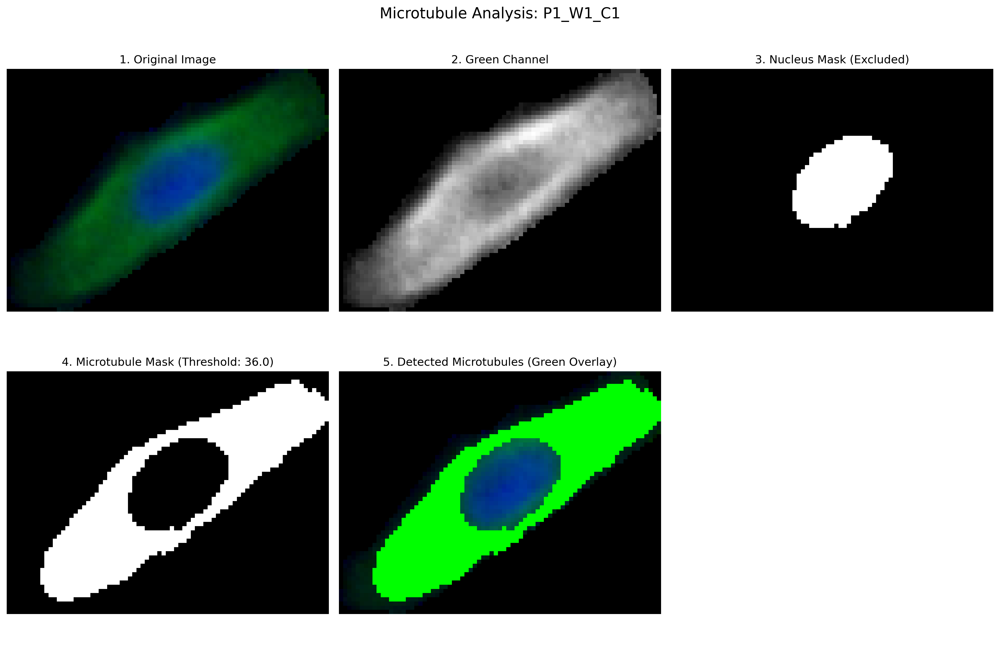
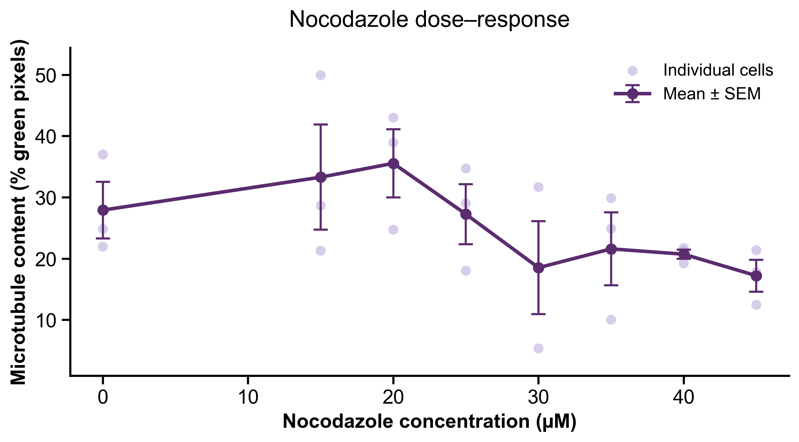

# Microtubule Quantification Tool

[](https://www.python.org/downloads/)
[](LICENSE)

An automated image analysis pipeline for quantifying microtubule content in fluorescent microscopy images. Designed for drug screening and dose-response analysis.

**Try it in your browser: https://microtubules.kalpkan.com** — the same measurement, on one image at a time, with nothing uploaded (the [`web/`](web/) folder; it matches this Python pipeline exactly on the sample cells, see [web/README.md](web/README.md#accuracy)).



## 🎯 What Does This Tool Do?

This tool automatically:
1. **Analyzes** fluorescent cell images (green = microtubules, blue = nuclei)
2. **Quantifies** the percentage of each cell occupied by microtubules
3. **Excludes** the nucleus from measurements
4. **Generates** dose-response curves with statistics
5. **Creates** publication-quality figures for posters and papers

Perfect for studying microtubule-targeting drugs like nocodazole, taxol, colchicine, or vinblastine.

## 📊 Example Results

Our validation experiment tested nocodazole (15-45 µM) on microtubule networks:



**Key Findings:**
- Untreated: 27.9 ± 4.6% microtubule content
- 45 µM nocodazole: 17.2 ± 2.6% (dose-dependent decrease)
- DMSO control: 0.00% (validated)
- Taxol control: 30.7 ± 9.5% (validated)

## 🚀 Quick Start

**New to this tool?** → Start with **[GETTING_STARTED.md](GETTING_STARTED.md)** for a step-by-step tutorial.

### Installation

```bash
git clone https://github.com/KalpKan/Microtubule-Quantification.git
cd Microtubule-Quantification
pip install -r requirements.txt
```

### Basic Workflow

```bash
# 1. Test on one cell
python test_single_cell.py path/to/cell.png

# 2. Run batch analysis on a folder of cropped cells
python run_analysis.py --input "path/to/cropped cells" --output path/to/results

# 3. Generate statistics
python generate_statistics.py --results Results/quantification_results.csv

# 4. Create poster figures
python generate_poster_figures.py --results Results/quantification_results.csv
```

See **[GETTING_STARTED.md](GETTING_STARTED.md)** for detailed instructions.

## 📁 What You Need

### Input Files

**1. Cell Images**
- Cropped individual cells (one cell per image)
- Fluorescent microscopy: green channel (microtubules), blue channel (nuclei)
- Formats: PNG, JPG, or TIFF

**2. Metadata File (metadata.csv)**
```csv
image_name,condition,dose,drug,include_in_curve
P1_W1_C1,untreated,0,None,yes
P3_W4_C1,nocodazole_15uM,15,Nocodazole,yes
P1_W2_C1,DMSO_control,0,DMSO,no
```

**Columns:**
- `image_name`: Filename without extension (must match your files)
- `condition`: Descriptive label
- `dose`: Numeric dose value (0 for controls)
- `drug`: Drug name or "None"
- `include_in_curve`: "yes" for dose-response, "no" for separate controls

## 📤 Output Files

### Per-Cell Outputs
- `[cellname]_mask.png` - Binary mask (white = microtubules detected)
- `[cellname]_overlay.png` - Original with green overlay
- `[cellname]_analysis.png` - Complete processing pipeline

### Summary Outputs
- `quantification_results.csv` - All measurements with metadata
- `dose_response_curve.png` - Scatter plot with mean ± SEM
- `dose_response_barplot.png` - Bar chart
- `nocodazole_dose_response_poster.png` - High-res poster figure (300 DPI)
- `nocodazole_dose_response_poster.pdf` - Vector format for printing

## 🔬 How It Works

### Processing Pipeline

1. **Extract green channel** - Isolate microtubule signal
2. **Detect nucleus** - Identify blue-stained regions
3. **Threshold** - Apply Otsu's method for optimal detection
4. **Exclude nucleus** - Remove nuclear regions from quantification
5. **Clean mask** - Remove noise with morphological operations
6. **Quantify** - Calculate: (green pixels / total pixels) × 100

### Statistical Analysis

The tool automatically calculates:
- **Descriptive statistics**: Mean, SEM, SD, CV, range
- **ANOVA**: Compare all doses
- **Correlation**: Dose vs microtubule content (Pearson & Spearman)
- **Linear regression**: R², slope, p-value
- **t-tests**: Pairwise comparisons

## 🧭 For non-developers: how to run this, deploy this, and where the settings live

### How to run this (the Python analysis, on your computer)

1. Install Python 3 (python.org) if you do not have it.
2. Open a terminal in this folder and run, once:
   ```bash
   python3 -m venv .venv
   .venv/bin/pip install -r requirements.txt
   ```
3. Put your cropped cell images (one cell per file) in a folder, and describe them in `metadata.csv` (one row per image, see "What You Need" above).
4. Run the analysis, pointing it at your folder:
   ```bash
   .venv/bin/python run_analysis.py --input "path/to/cropped cells" --output results
   ```
   Results (CSV, masks, overlays, dose-response plots) appear in the `results` folder.
5. To check the code still works after a change: `.venv/bin/python -m unittest tests/test_run_analysis.py -v`.

### How to run this (the browser version)

Open https://microtubules.kalpkan.com on a phone or a laptop, tap "Choose an image" or "Take a photo", or try one of the three samples. To run it on your own computer instead, see [web/README.md](web/README.md#how-to-run-this) (needs Node.js).

### How to deploy this

Only the browser version is deployed; the Python scripts run locally. The web page is on Vercel (free plan, $0) as project `microtubules`, root directory `web`, and redeploys itself whenever `main` is pushed to GitHub. Manual deploy and the health check are described in [web/README.md](web/README.md#how-to-deploy-this).

### Where the settings live

- Python scripts: there are no settings files; every option is a command-line flag (`--input`, `--output`, `--metadata`), with the old Desktop folders as defaults in `run_analysis.py`.
- Browser version: one optional, non-secret environment variable, `VITE_PUBLIC_POSTHOG_KEY` (anonymous usage analytics), kept in the Vercel dashboard for project `microtubules`. Names are listed in `web/.env.example`; there are no secrets anywhere in this repository.
- Domain `microtubules.kalpkan.com`: a DNS record in Cloudflare pointing at the Vercel project (recorded in Kalp's portfolio repo).

## 📖 Documentation

- **[USAGE_GUIDE.md](USAGE_GUIDE.md)** - Detailed step-by-step instructions
- **[QUICK_REFERENCE.md](QUICK_REFERENCE.md)** - Command cheat sheet
- **[STATISTICS_GUIDE.md](STATISTICS_GUIDE.md)** - Statistical analysis explained
- **[CHANGELOG.md](CHANGELOG.md)** - Version history

## 🛠️ Scripts Overview

| Script | Purpose |
|--------|---------|
| `microtubule_quantification.py` | Main analysis pipeline (batch processing) |
| `test_single_cell.py` | Test on one cell before batch processing |
| `run_analysis.py` | Easy wrapper script: `python run_analysis.py --input <cells folder> --output <results folder> [--metadata metadata.csv]` (no flags = the original default folders) |
| `generate_statistics.py` | Comprehensive statistical analysis |
| `generate_poster_figures.py` | Publication-quality figures (300 DPI) |

## 💡 Tips for Best Results

1. **Use consistent imaging settings** across all samples
2. **Include controls**: untreated, vehicle (DMSO), and positive control (taxol)
3. **Minimum n=3 cells per condition** (n=5+ recommended)
4. **Check masks visually** to verify correct detection
5. **Crop cells carefully** - include entire cell, minimize background

## 🔧 Troubleshooting

| Problem | Solution |
|---------|----------|
| Empty dose-response plots | Check `image_name` in metadata matches filenames exactly |
| Masks look incorrect | Run `test_single_cell.py` to verify detection |
| High variability | Increase sample size (n≥5) or check imaging consistency |
| Images not found | Verify file paths and extensions (PNG vs png) |

See [USAGE_GUIDE.md](USAGE_GUIDE.md) for detailed troubleshooting.

## 📊 Example Use Cases

- Drug screening for microtubule-targeting compounds
- Dose-response analysis of cytoskeletal drugs
- Comparing microtubule networks across conditions
- Cell cycle analysis (microtubule dynamics)
- High-content screening applications

## 📝 Citation

If you use this tool in your research, please cite:

```
Kan, K. (2024). Microtubule Quantification Tool: Automated image analysis 
for fluorescent microscopy. GitHub repository. 
https://github.com/KalpKan/Microtubule-Quantification
```

## 📄 License

This project is licensed under the MIT License - see [LICENSE](LICENSE) for details.

## 🤝 Contributing

Contributions are welcome! Please feel free to submit issues or pull requests.

## 📧 Contact

For questions or issues, please [open an issue](https://github.com/KalpKan/Microtubule-Quantification/issues) on GitHub.

## 🙏 Acknowledgments

Developed for quantitative analysis of microtubule-targeting drug effects in cell biology research.

---

**Keywords**: microtubule quantification, fluorescence microscopy, image analysis, drug screening, dose-response, cell biology, automated analysis, Python, OpenCV
